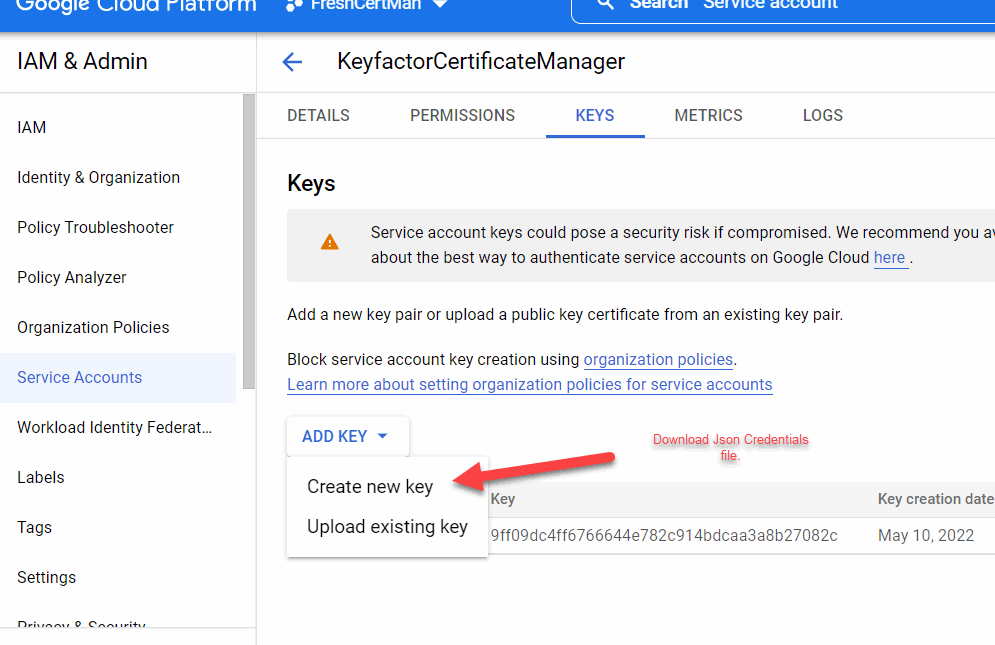
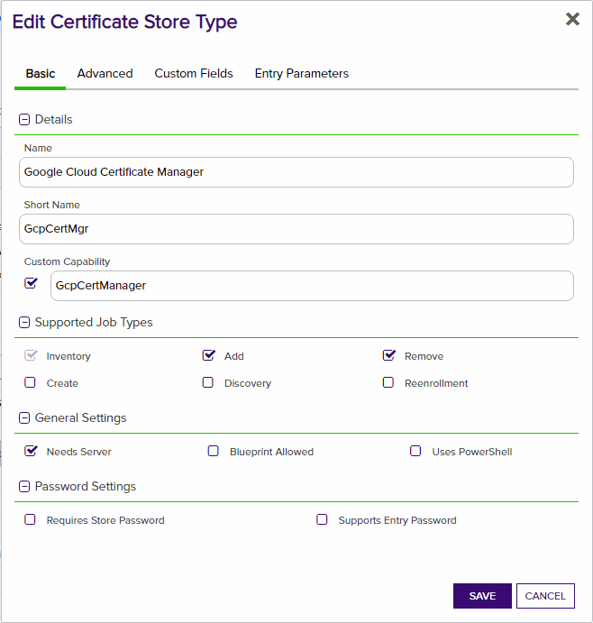
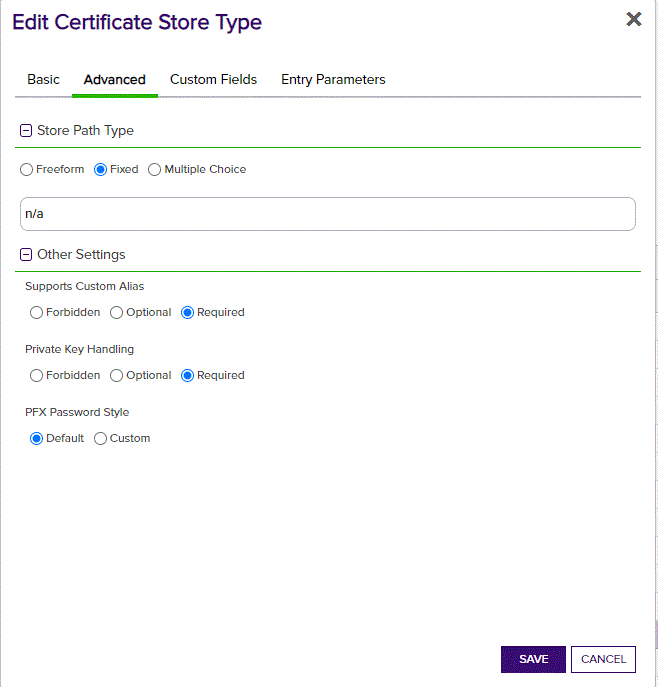
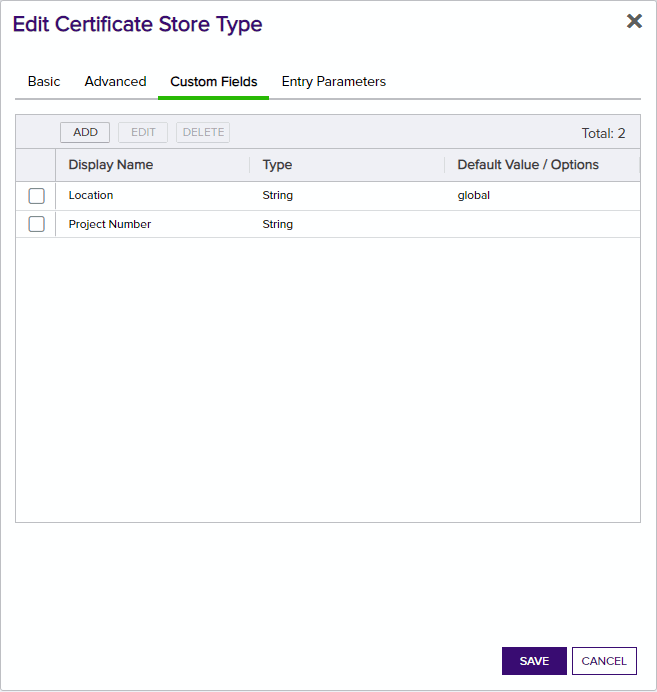
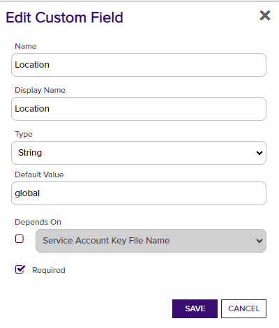
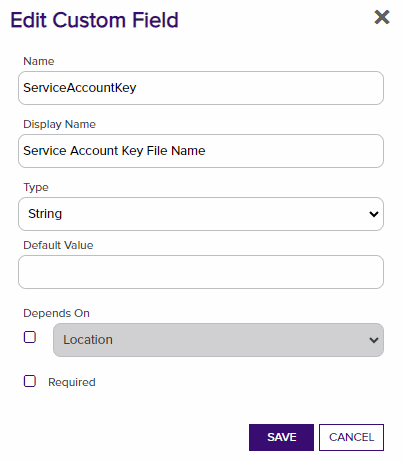
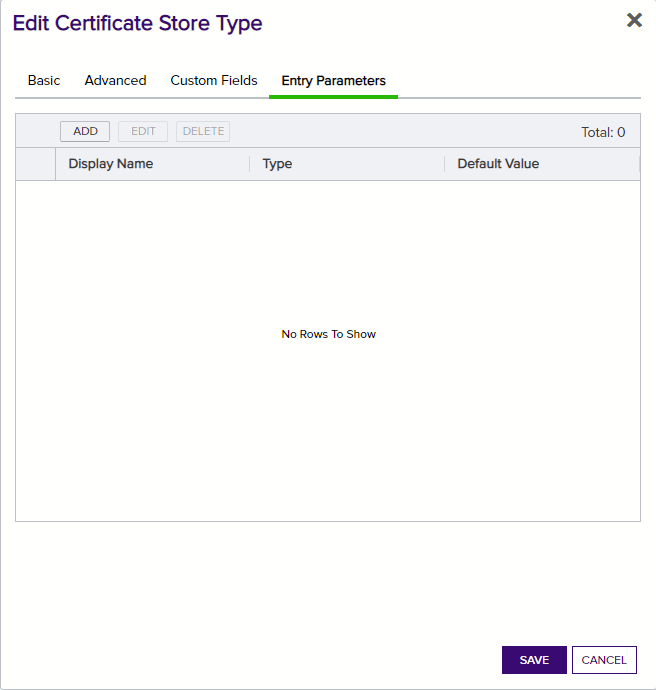
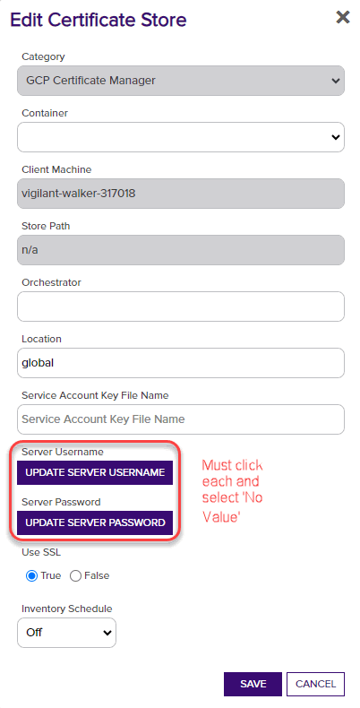

# Google Cloud Provider Certificate Manager

Google Certificate Manager Orchestrator for Add, Remove and Inventory.

#### Integration status: Pilot - Ready for use in test environments. Not for use in production.

## About the Keyfactor Universal Orchestrator Extension

This repository contains a Universal Orchestrator Extension which is a plugin to the Keyfactor Universal Orchestrator. Within the Keyfactor Platform, Orchestrators are used to manage “certificate stores” &mdash; collections of certificates and roots of trust that are found within and used by various applications.

The Universal Orchestrator is part of the Keyfactor software distribution and is available via the Keyfactor customer portal. For general instructions on installing Extensions, see the “Keyfactor Command Orchestrator Installation and Configuration Guide” section of the Keyfactor documentation. For configuration details of this specific Extension see below in this readme.

The Universal Orchestrator is the successor to the Windows Orchestrator. This Orchestrator Extension plugin only works with the Universal Orchestrator and does not work with the Windows Orchestrator.

## Support for Google Cloud Provider Certificate Manager

Google Cloud Provider Certificate Manager 

###### To report a problem or suggest a new feature, use the **[Issues](../../issues)** tab. If you want to contribute actual bug fixes or proposed enhancements, use the **[Pull requests](../../pulls)** tab.

---

## Keyfactor Version Supported

The minimum version of the Keyfactor Universal Orchestrator Framework needed to run this version of the extension is 10.4.1

## Platform Specific Notes

The Keyfactor Universal Orchestrator may be installed on either Windows or Linux based platforms. The certificate operations supported by a capability may vary based what platform the capability is installed on. The table below indicates what capabilities are supported based on which platform the encompassing Universal Orchestrator is running.
| Operation | Win | Linux |
|-----|-----|------|
|Supports Management Add|&check; |&check; |
|Supports Management Remove|&check; |&check; |
|Supports Create Store|  |  |
|Supports Discovery|  |  |
|Supports Renrollment|  |  |
|Supports Inventory|&check; |&check; |

---

## Google Cloud Platform Certificate Manager

**Overview**

The GCP Certificate Manager Orchestrator Extension remotely manages certificates on the Google Cloud Platform Certificate Manager Product

This orchestrator extension implements three job types – Inventory, Management Add, and Management Remove. Below are the steps necessary to configure this Orchestrator Extension.  It supports adding certificates with private keys only.  The GCP Certificate Manager Orchestrator Extension supports the replacement of unbound certificates as well as certificates bound to existing map entries, but it does **not** support specifying map entry bindings when adding new certificates.

**Google Cloud Configuration**

1. Read up on [Google Certificate Manager](https://cloud.google.com/certificate-manager/docs) and how it works.

2. Either a Google Service Account is needed with the following permissions (Note: Workload Identity Management Should be used but at the time of the writing it was not available in the .net library yet), or the virtual machine running the Keyfactor Orchestrator Service must reside within Google Cloud.

3. The following Api Access is needed:

4. If authenticating via service account, download the Json Credential file as shown below:

## Keyfactor Command Configuration

**1. Create the New Certificate Store Type for the GCP Certificate Manager Orchestrator**

In Keyfactor Command create a new Certificate Store Type similar to the one below:

#### STORE TYPE CONFIGURATION
SETTING TAB  |  CONFIG ELEMENT	| DESCRIPTION
------|-----------|------------------
Basic |Name	|Descriptive name for the Store Type.  Example: Google Cloud Certificate Manager
Basic |Short Name	|The name that identifies the registered functionality of the orchestrator. Must be GcpCertMgr
Basic |Custom Capability|Unchecked
Basic |Job Types	|Inventory, Add, and Remove are the supported job types
Basic |Needs Server	|Unchecked
Basic |Blueprint Allowed	|Unchecked
Basic |Requires Store Password	|Unchecked
Basic |Supports Entry Password	|Unchecked
Advanced |Store Path Type| Fixed
Advanced |Store Path Type Value (the textbox that appears below Store Path Type when Store Path Type is set to "Fixed")	|n/a
Advanced |Supports Custom Alias	|Required
Advanced |Private Key Handling |Required
Advanced |PFX Password Style |Default
Custom Fields|Google Cloud Platform Project Location/Region|Name:Location, Display Name:Location, Type:String, Default Value:global, Required:False
Custom Fields|The file name of the Google Cloud Service Account Key File installed in the same folder as the orchestrator extension.  Empty if the orchestrator server resides in GCP and you are not using a service account key |Name:Service Account Key File Name, Type:String, Default Value: (leave blank), Required:True
Entry Parameters|N/A| There are no Entry Parameters

**Basic Settings:**

**Advanced Settings:**

**Custom Fields:**

**Entry Params:**

**2. Register the GCP Certificate Manager Orchestrator with Keyfactor**
See Keyfactor InstallingKeyfactorOrchestrators.pdf Documentation.  Get from your Keyfactor contact/representative.

**3. Create a GCP Certificate Manager Certificate Store within Keyfactor Command**
In Keyfactor Command create a new Certificate Store similar to the one below

#### STORE CONFIGURATION 
CONFIG ELEMENT	|DESCRIPTION
----------------|---------------
Category	|The type of certificate store to be configured. Select category based on the display name configured above "GCP Certificate Manager".
Container	|This is a logical grouping of like stores. This configuration is optional and does not impact the functionality of the store.
Client Machine	|Your GCP Project ID for your account.
Store Path	|This is not used and should be defaulted to n/a per the certificate store type set up.
Orchestrator	|This is the orchestrator server registered with the appropriate capabilities to manage this certificate store type. 
Location|**global** is the default but could be another region based on the project.
Service Account Key File Name | The name of the file containing the GCP Service Account JSON formatted key previously downloaded.  Keep this optional field blank if the Keyfactor Orchestrator Service is running from an authenticated VM within Google Cloud.
Update Server User Name |Click and select No Value.
Update Server Password |Click and select No Value.
Use SSL	|This should be checked.
Inventory Schedule	|The interval that the system will use to report on what certificates are currently in the store. 

