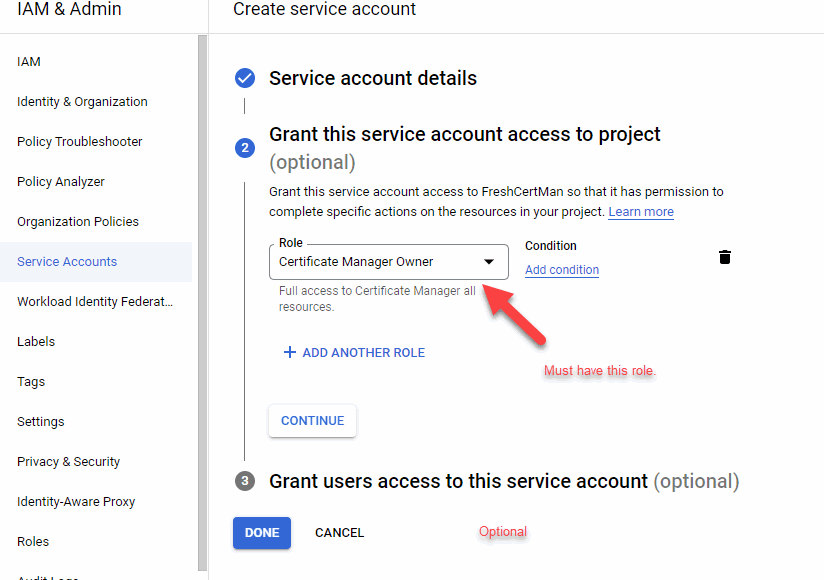
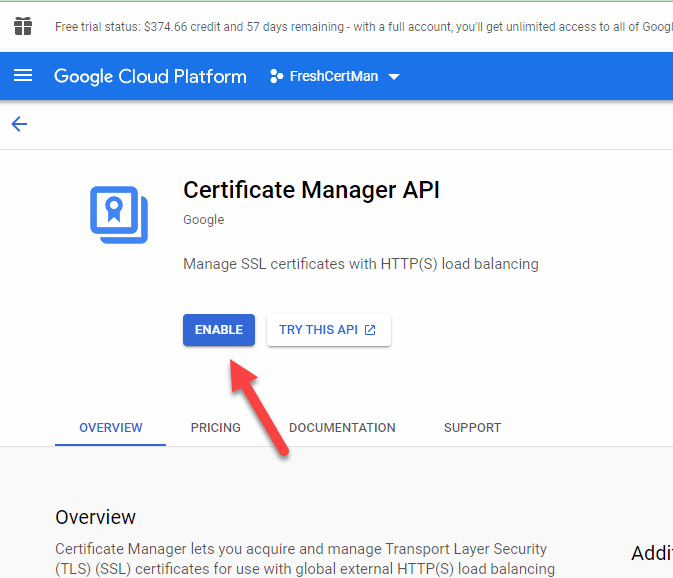
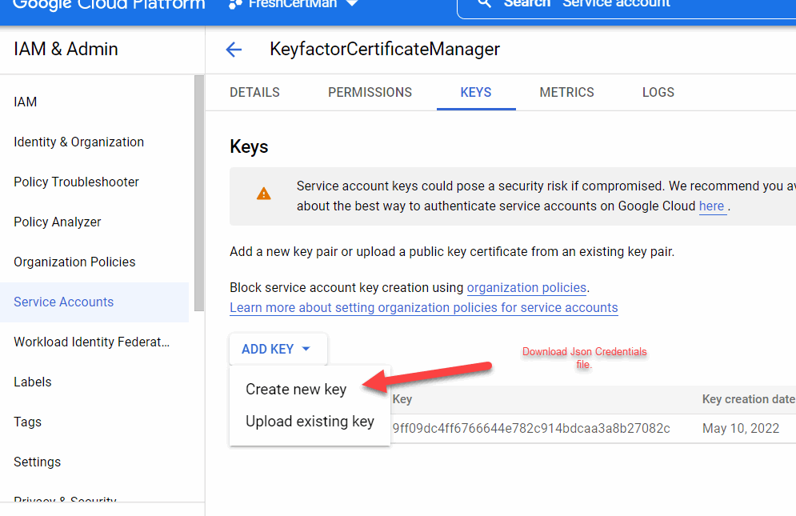
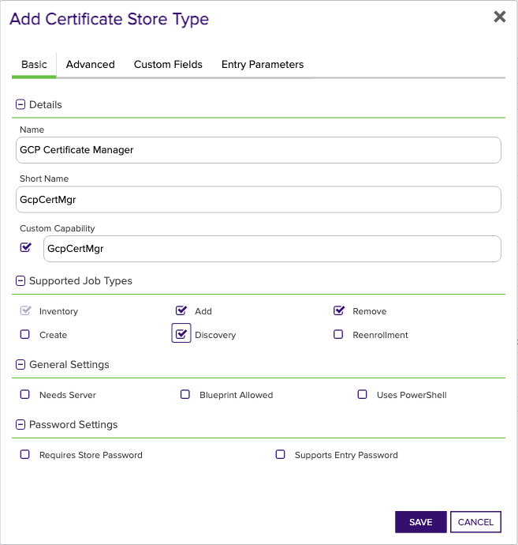
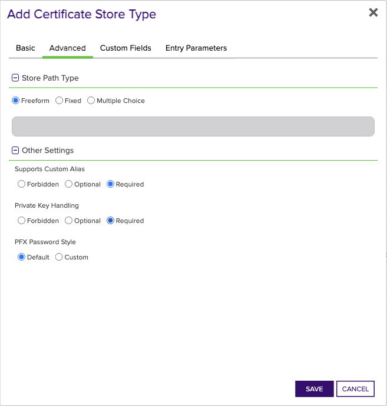
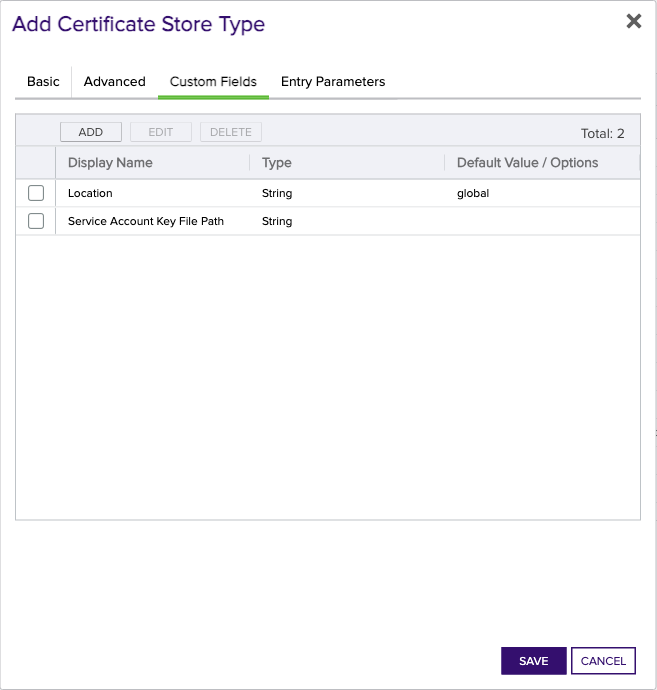

<h1 align="center" style="border-bottom: none">
    Google Cloud Provider Certificate Manager Universal Orchestrator Extension
</h1>

<p align="center">
  <!-- Badges -->

<a href="https://github.com/Keyfactor/gcp-certmanager-orchestrator/releases"></a>


</p>

<p align="center">
  <!-- TOC -->
  <a href="#support">
    <b>Support</b>
  </a>
  ·
  <a href="#installation">
    <b>Installation</b>
  </a>
  ·
  <a href="#license">
    <b>License</b>
  </a>
  ·
  <a href="https://github.com/orgs/Keyfactor/repositories?q=orchestrator">
    <b>Related Integrations</b>
  </a>
</p>

## Overview

The GCP Certificate Manager Orchestrator Extension remotely manages certificates on the Google Cloud Platform Certificate Manager Product.

This orchestrator extension implements four job types - Inventory, Management Add, Management Remove, and Discovery. Below are the steps necessary to configure this Orchestrator Extension.  It supports adding certificates with private keys only.  The GCP Certificate Manager Orchestrator Extension supports the replacement of unbound certificates as well as certificates bound to existing map entries, but it does **not** support specifying map entry bindings when adding new certificates.

The Discovery job enumerates every GCP project that the orchestrator's service account can see and proposes one candidate store per (project, location) pair. The actual scope of discovery is bounded by IAM - grant the service account the appropriate role at the organization or folder root and Discovery will return everything underneath. See the GCP Certificate Manager store-type page for the operator-facing details.


## Compatibility

This integration is compatible with Keyfactor Universal Orchestrator version 10.4.1 and later.

## Support
The Google Cloud Provider Certificate Manager Universal Orchestrator extension is supported by Keyfactor. If you require support for any issues or have feature request, please open a support ticket by either contacting your Keyfactor representative or via the Keyfactor Support Portal at https://support.keyfactor.com.

> If you want to contribute bug fixes or additional enhancements, use the **[Pull requests](../../pulls)** tab.

## Requirements & Prerequisites

Before installing the Google Cloud Provider Certificate Manager Universal Orchestrator extension, we recommend that you install [kfutil](https://github.com/Keyfactor/kfutil). Kfutil is a command-line tool that simplifies the process of creating store types, installing extensions, and instantiating certificate stores in Keyfactor Command.


**Google Cloud Configuration**

1. Read up on [Google Certificate Manager](https://cloud.google.com/certificate-manager/docs) and how it works.

2. Either a Google Service Account is needed with the following permissions (Note: Workload Identity Management Should be used but at the time of the writing it was not available in the .net library yet), or the virtual machine running the Keyfactor Orchestrator Service must reside within Google Cloud.


3. The following Api Access is needed:


4. If authenticating via service account, download the Json Credential file as shown below:



## GcpCertMgr Certificate Store Type

To use the Google Cloud Provider Certificate Manager Universal Orchestrator extension, you **must** create the GcpCertMgr Certificate Store Type. This only needs to happen _once_ per Keyfactor Command instance.


The `GcpCertMgr` store type represents a single (Project, Location) pair within Google Cloud Certificate Manager. The orchestrator manages self-managed certificates inside that container - listing them for inventory, uploading new PFX certificates, and deleting existing certificates by alias.

#### Discovery

The Discovery job is configured against the GCP Certificate Manager store type and enumerates candidate stores across an entire GCP organization. It uses the Cloud Resource Manager v3 API (`projects.search`) to list every active project the orchestrator's service account can see, then emits one candidate store path per (project, location) combination in the canonical GCP form `projects/{projectId}/locations/{location}`.

##### Configuring the discovery job

| Field on the discovery-job form | What to put |
|---|---|
| **Client Machine** | The GCP Organization ID (e.g. `123456789012`). Recorded in logs only - actual project visibility is enforced by IAM. |
| **Server Username / Server Password** | Not used. Leave blank. The orchestrator authenticates via the configured GCP service account, not via username/password. |
| **Directories to search** | Comma-separated list of GCP locations (regions) to enumerate, e.g. `global,us-central1,europe-west1`. Leave blank to default to `global`. |

##### Service account credentials

Discovery resolves credentials in the same way the inventory and management jobs do:

1. If the optional `ServiceAccountKey` job property is provided, the JSON key file with that name is read from the orchestrator extension directory.
2. Otherwise, `GoogleCredential.GetApplicationDefault()` is used. This is the recommended path when the orchestrator runs on a GCE VM or GKE pod with a workload-identity-bound service account.

The service account needs at minimum the `resourcemanager.projects.list` permission at the organization root (or wherever you want discovery to be scoped). If you also want operators to be able to inventory the discovered stores immediately after approval, the same service account needs `certificatemanager.certificates.list` on those projects.

##### Approving discovered stores

Discovered store paths arrive in Keyfactor Command in the form `projects/{projectId}/locations/{location}`. **Command does not auto-populate `ClientMachine` or the `Location` custom property from the discovered path** - the operator must edit each candidate before approving:

1. Set **Client Machine** on the new store to the project ID (e.g. `my-pki-project`).
2. Set the **Location** custom property to the region (e.g. `global`).
3. Set the **Service Account Key File Path** custom property to the JSON key filename (or leave blank to use Application Default Credentials).
4. Approve.

After approval the store is treated like any other manually-created `GcpCertMgr` store - the inventory job will run against it on its configured schedule.

#### Architecture and logging

Every job (Discovery, Inventory, Management) uses a shared `FlowLogger` to record step-by-step progress with timing. The flow summary is appended to `JobResult.FailureMessage` on **both** success and failure paths so operators reading job history can see what happened without having to pull orchestrator-side trace logs. Errors arising from the GCP SDK are unwrapped through `AggregateException` walls and reported with HTTP status + the GCP error response body, so quota errors / IAM denials / malformed certificates surface clearly in Command's UI.

#### Vendor docs

- [Google Cloud Certificate Manager](https://cloud.google.com/certificate-manager/docs)
- [Cloud Resource Manager v3 - projects.search](https://cloud.google.com/resource-manager/reference/rest/v3/projects/search)
- [Application Default Credentials](https://cloud.google.com/docs/authentication/application-default-credentials)


#### Supported Operations

| Operation    | Is Supported                                                                                                           |
|--------------|------------------------------------------------------------------------------------------------------------------------|
| Add          | ✅ Checked        |
| Remove       | ✅ Checked     |
| Discovery    | ✅ Checked  |
| Reenrollment | 🔲 Unchecked |
| Create       | ✅ Checked     |

#### Store Type Creation

##### Using kfutil:
`kfutil` is a custom CLI for the Keyfactor Command API and can be used to create certificate store types.
For more information on [kfutil](https://github.com/Keyfactor/kfutil) check out the [docs](https://github.com/Keyfactor/kfutil?tab=readme-ov-file#quickstart)
   <details><summary>Click to expand GcpCertMgr kfutil details</summary>

   ##### Using online definition from GitHub:
   This will reach out to GitHub and pull the latest store-type definition
   ```shell
   # GCP Certificate Manager
   kfutil store-types create GcpCertMgr
   ```

   ##### Offline creation using integration-manifest file:
   If required, it is possible to create store types from the [integration-manifest.json](./integration-manifest.json) included in this repo.
   You would first download the [integration-manifest.json](./integration-manifest.json) and then run the following command
   in your offline environment.
   ```shell
   kfutil store-types create --from-file integration-manifest.json
   ```
   </details>


#### Manual Creation
Below are instructions on how to create the GcpCertMgr store type manually in
the Keyfactor Command Portal
   <details><summary>Click to expand manual GcpCertMgr details</summary>

   Create a store type called `GcpCertMgr` with the attributes in the tables below:

   ##### Basic Tab
   | Attribute | Value | Description |
   | --------- | ----- | ----- |
   | Name | GCP Certificate Manager | Display name for the store type (may be customized) |
   | Short Name | GcpCertMgr | Short display name for the store type |
   | Capability | GcpCertMgr | Store type name orchestrator will register with. Check the box to allow entry of value |
   | Supports Add | ✅ Checked | Check the box. Indicates that the Store Type supports Management Add |
   | Supports Remove | ✅ Checked | Check the box. Indicates that the Store Type supports Management Remove |
   | Supports Discovery | ✅ Checked | Check the box. Indicates that the Store Type supports Discovery |
   | Supports Reenrollment | 🔲 Unchecked |  Indicates that the Store Type supports Reenrollment |
   | Supports Create | ✅ Checked | Check the box. Indicates that the Store Type supports store creation |
   | Needs Server | 🔲 Unchecked | Determines if a target server name is required when creating store |
   | Blueprint Allowed | 🔲 Unchecked | Determines if store type may be included in an Orchestrator blueprint |
   | Uses PowerShell | 🔲 Unchecked | Determines if underlying implementation is PowerShell |
   | Requires Store Password | 🔲 Unchecked | Enables users to optionally specify a store password when defining a Certificate Store. |
   | Supports Entry Password | 🔲 Unchecked | Determines if an individual entry within a store can have a password. |

   The Basic tab should look like this:

   

   ##### Advanced Tab
   | Attribute | Value | Description |
   | --------- | ----- | ----- |
   | Supports Custom Alias | Required | Determines if an individual entry within a store can have a custom Alias. |
   | Private Key Handling | Required | This determines if Keyfactor can send the private key associated with a certificate to the store. Required because IIS certificates without private keys would be invalid. |
   | PFX Password Style | Default | 'Default' - PFX password is randomly generated, 'Custom' - PFX password may be specified when the enrollment job is created (Requires the Allow Custom Password application setting to be enabled.) |

   The Advanced tab should look like this:

   

   > For Keyfactor **Command versions 24.4 and later**, a Certificate Format dropdown is available with PFX and PEM options. Ensure that **PFX** is selected, as this determines the format of new and renewed certificates sent to the Orchestrator during a Management job. Currently, all Keyfactor-supported Orchestrator extensions support only PFX.

   ##### Custom Fields Tab
   Custom fields operate at the certificate store level and are used to control how the orchestrator connects to the remote target server containing the certificate store to be managed. The following custom fields should be added to the store type:

   | Name | Display Name | Description | Type | Default Value/Options | Required |
   | ---- | ------------ | ---- | --------------------- | -------- | ----------- |
   | Location | Location | The GCP region used for this Certificate Manager instance.  **global** is the default but could be another region based on the project. | String | global | ✅ Checked |
   | ServiceAccountKey | Service Account Key File Path | The file name of the Google Cloud Service Account Key File installed in the same folder as the orchestrator extension. Empty if the orchestrator server resides in GCP and you are not using a service account key. | String |  | 🔲 Unchecked |

   The Custom Fields tab should look like this:

   


   ###### Location
   The GCP region used for this Certificate Manager instance.  **global** is the default but could be another region based on the project.

   
   


   ###### Service Account Key File Path
   The file name of the Google Cloud Service Account Key File installed in the same folder as the orchestrator extension. Empty if the orchestrator server resides in GCP and you are not using a service account key.

   
   


   </details>

## Installation

1. **Download the latest Google Cloud Provider Certificate Manager Universal Orchestrator extension from GitHub.**

    Navigate to the [Google Cloud Provider Certificate Manager Universal Orchestrator extension GitHub version page](https://github.com/Keyfactor/gcp-certmanager-orchestrator/releases/latest). Refer to the compatibility matrix below to determine the asset should be downloaded. Then, click the corresponding asset to download the zip archive.

   | Universal Orchestrator Version | Latest .NET version installed on the Universal Orchestrator server | `rollForward` condition in `Orchestrator.runtimeconfig.json` | `gcp-certmanager-orchestrator` .NET version to download |
   | --------- | ----------- | ----------- | ----------- |
   | Older than `11.0.0` | | | `net6.0` |
   | Between `11.0.0` and `11.5.1` (inclusive) | `net6.0` | | `net6.0` |
   | Between `11.0.0` and `11.5.1` (inclusive) | `net8.0` | `Disable` | `net6.0` || Between `11.0.0` and `11.5.1` (inclusive) | `net8.0` | `LatestMajor` | `net8.0` |
   | `11.6` _and_ newer | `net8.0` | | `net8.0` | 

    Unzip the archive containing extension assemblies to a known location.

    > **Note** If you don't see an asset with a corresponding .NET version, you should always assume that it was compiled for `net6.0`.

2. **Locate the Universal Orchestrator extensions directory.**

    * **Default on Windows** - `C:\Program Files\Keyfactor\Keyfactor Orchestrator\extensions`
    * **Default on Linux** - `/opt/keyfactor/orchestrator/extensions`

3. **Create a new directory for the Google Cloud Provider Certificate Manager Universal Orchestrator extension inside the extensions directory.**

    Create a new directory called `gcp-certmanager-orchestrator`.
    > The directory name does not need to match any names used elsewhere; it just has to be unique within the extensions directory.

4. **Copy the contents of the downloaded and unzipped assemblies from __step 2__ to the `gcp-certmanager-orchestrator` directory.**

5. **Restart the Universal Orchestrator service.**

    Refer to [Starting/Restarting the Universal Orchestrator service](https://software.keyfactor.com/Core-OnPrem/Current/Content/InstallingAgents/NetCoreOrchestrator/StarttheService.htm).


> The above installation steps can be supplemented by the [official Command documentation](https://software.keyfactor.com/Core-OnPrem/Current/Content/InstallingAgents/NetCoreOrchestrator/CustomExtensions.htm?Highlight=extensions).


## Defining Certificate Stores


### Store Creation

#### Manually with the Command UI

<details><summary>Click to expand details</summary>

1. **Navigate to the _Certificate Stores_ page in Keyfactor Command.**

    Log into Keyfactor Command, toggle the _Locations_ dropdown, and click _Certificate Stores_.

2. **Add a Certificate Store.**

    Click the Add button to add a new Certificate Store. Use the table below to populate the **Attributes** in the **Add** form.

   | Attribute | Description                                             |
   | --------- |---------------------------------------------------------|
   | Category | Select "GCP Certificate Manager" or the customized certificate store name from the previous step. |
   | Container | Optional container to associate certificate store with. |
   | Client Machine | GCP Project ID for your account. |
   | Store Path | This is not used and should be defaulted to n/a per the certificate store type set up. |
   | Orchestrator | Select an approved orchestrator capable of managing `GcpCertMgr` certificates. Specifically, one with the `GcpCertMgr` capability. |
   | Location | The GCP region used for this Certificate Manager instance.  **global** is the default but could be another region based on the project. |
   | ServiceAccountKey | The file name of the Google Cloud Service Account Key File installed in the same folder as the orchestrator extension. Empty if the orchestrator server resides in GCP and you are not using a service account key. |

</details>


#### Using kfutil CLI

<details><summary>Click to expand details</summary>

1. **Generate a CSV template for the GcpCertMgr certificate store**

    ```shell
    kfutil stores import generate-template --store-type-name GcpCertMgr --outpath GcpCertMgr.csv
    ```
2. **Populate the generated CSV file**

    Open the CSV file, and reference the table below to populate parameters for each **Attribute**.

   | Attribute | Description |
   | --------- | ----------- |
   | Category | Select "GCP Certificate Manager" or the customized certificate store name from the previous step. |
   | Container | Optional container to associate certificate store with. |
   | Client Machine | GCP Project ID for your account. |
   | Store Path | This is not used and should be defaulted to n/a per the certificate store type set up. |
   | Orchestrator | Select an approved orchestrator capable of managing `GcpCertMgr` certificates. Specifically, one with the `GcpCertMgr` capability. |
   | Properties.Location | The GCP region used for this Certificate Manager instance.  **global** is the default but could be another region based on the project. |
   | Properties.ServiceAccountKey | The file name of the Google Cloud Service Account Key File installed in the same folder as the orchestrator extension. Empty if the orchestrator server resides in GCP and you are not using a service account key. |

3. **Import the CSV file to create the certificate stores**

    ```shell
    kfutil stores import csv --store-type-name GcpCertMgr --file GcpCertMgr.csv
    ```

</details>


> The content in this section can be supplemented by the [official Command documentation](https://software.keyfactor.com/Core-OnPrem/Current/Content/ReferenceGuide/Certificate%20Stores.htm?Highlight=certificate%20store).


## License

Apache License 2.0, see [LICENSE](LICENSE).

## Related Integrations

See all [Keyfactor Universal Orchestrator extensions](https://github.com/orgs/Keyfactor/repositories?q=orchestrator).