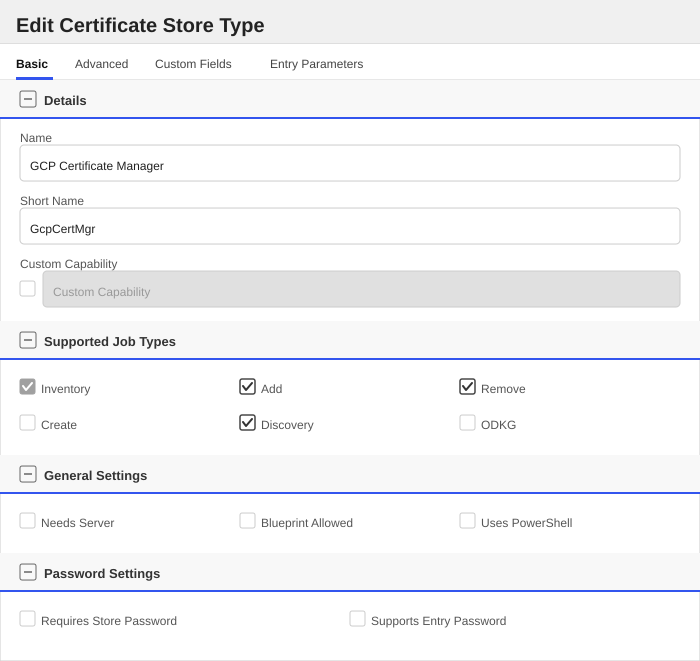
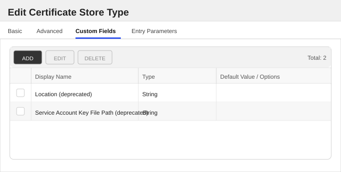
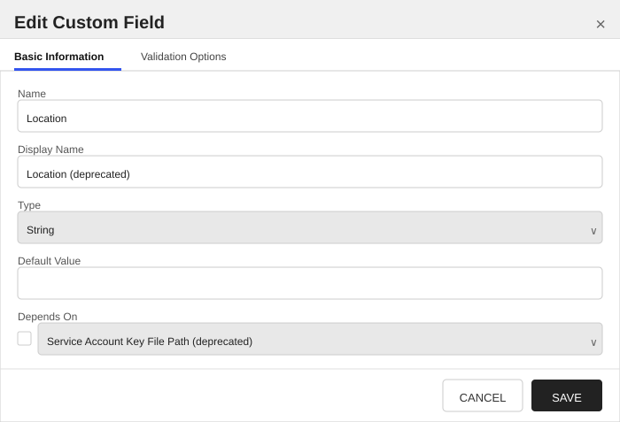
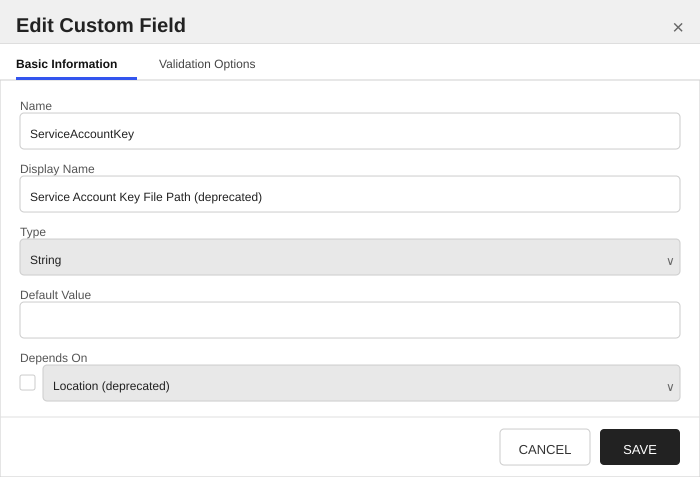
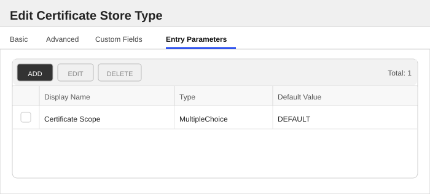
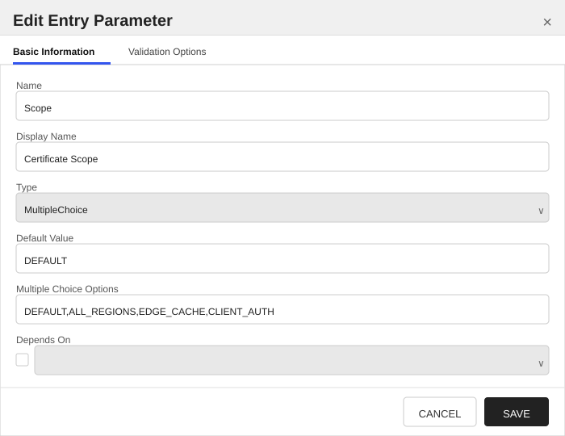
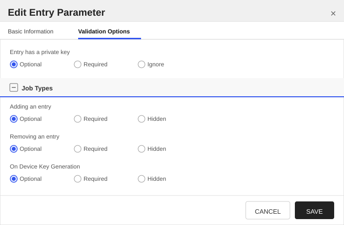

<h1 align="center" style="border-bottom: none">
    Google Cloud Provider Certificate Manager Universal Orchestrator Extension
</h1>


<p align="center">
  <!-- Badges -->

<a href="https://github.com/Keyfactor/Google Cloud Provider Certificate Manager/releases"></a>


</p>

<p align="center">
  <!-- TOC -->
  <a href="#support">
    <b>Support</b>
  </a>
  ·
  <a href="#installation">
    <b>Installation</b>
  </a>
  ·
  <a href="#license">
    <b>License</b>
  </a>
  ·
  <a href="https://github.com/orgs/Keyfactor/repositories?q=orchestrator">
    <b>Related Integrations</b>
  </a>
</p>

## Overview

The GCP Certificate Manager Orchestrator Extension remotely manages certificates on the Google Cloud Platform Certificate Manager Product.

This orchestrator extension implements four job types - Inventory, Management Add, Management Remove, and Discovery. It supports adding certificates with private keys only. The orchestrator supports the replacement of unbound certificates as well as certificates bound to existing map entries, but it does **not** support specifying map entry bindings when adding new certificates.

### Configuration model

Every `GcpCertMgr` store identifies its target Certificate Manager instance through the canonical GCP resource path in **Store Path**:

```
projects/{projectId}/locations/{location}
```

This applies equally to manually-created stores and Discovery-approved stores. The `Location` custom property is deprecated as of v1.2 and used only as a v1.1 backwards-compatibility fallback. **Client Machine** is a display label for grouping in Command's UI - the recommended value is the GCP Organization ID.

The Discovery job enumerates every GCP project that the orchestrator's service account can see and proposes one candidate store per (project, location) pair, with Store Path pre-populated in canonical form. The actual scope of discovery is bounded by IAM - grant the service account the appropriate role at the organization root and Discovery will return everything underneath. See the GCP Certificate Manager store-type page for full operator-facing details.

## Compatibility

This integration is compatible with Keyfactor Universal Orchestrator version 10.4.1 and later.

## Support

The Google Cloud Provider Certificate Manager Universal Orchestrator extension is supported by Keyfactor. If you require support for any issues or have feature request, please open a support ticket by either contacting your Keyfactor representative or via the Keyfactor Support Portal at https://support.keyfactor.com.

> If you want to contribute bug fixes or additional enhancements, use the **[Pull requests](../../pulls)** tab.

## Requirements & Prerequisites

Before installing the Google Cloud Provider Certificate Manager Universal Orchestrator extension, we recommend that you install [kfutil](https://github.com/Keyfactor/kfutil). Kfutil is a command-line tool that simplifies the process of creating store types, installing extensions, and instantiating certificate stores in Keyfactor Command.

## GcpCertMgr Certificate Store Type

To use the Google Cloud Provider Certificate Manager Universal Orchestrator extension, you **must** create the GcpCertMgr Certificate Store Type. This only needs to happen _once_ per Keyfactor Command instance.

The `GcpCertMgr` store type represents a single (Project, Location) pair within Google Cloud Certificate Manager. The orchestrator manages self-managed certificates inside that container - listing them for inventory, uploading new PFX certificates, and deleting existing certificates by alias.

#### Configuration model (v1.2+)

Every `GcpCertMgr` store - whether Discovery-approved or manually created - identifies its target Certificate Manager instance through the **Store Path** field:

```
projects/{projectId}/locations/{location}
```

That single value carries both the GCP project and the location (region or `global`). Inventory and Management read it directly; **Client Machine** is a display label for grouping in Command's UI and is not parsed by the orchestrator.

##### Field semantics

| Field | What it carries | Read by |
|---|---|---|
| **Store Path** | Canonical GCP resource path: `projects/{projectId}/locations/{location}`. The `{location}` segment is the GCP region (or `global`) the store targets - this is the only place the orchestrator actually reads the location from for new stores. | Inventory, Management, Discovery (emit) |
| **Client Machine** | Display label only. Recommended: GCP Organization ID (e.g. `1005564431893`). Not parsed. | UI grouping in Command |
| **Service Account Key File Path** (custom, *deprecated*) | v1.1 shape only. Leave blank for new stores - authentication uses Application Default Credentials. | Credential loader fallback; emits a deprecation warning when read |
| **Location** (custom, *deprecated*) | v1.1 shape only. New stores leave it blank. Used as a fallback when Store Path is empty or `n/a`. | v1.1 fallback path; emits a deprecation warning when read |
| **Certificate Scope** (*entry parameter*, not a store property) | GCP `scope` for an individual certificate entry. One of `DEFAULT`, `ALL_REGIONS`, `EDGE_CACHE`, `CLIENT_AUTH`. Set per-cert at Add time; Inventory persists the existing value back from GCP so renewals carry it forward. Defined under the store type's EntryParameters, not Properties. See "Certificate scope" below. | Management/Add (read from `JobProperties`), Inventory (write to per-entry `Parameters`) |

##### Location semantics: where the GCP region lives

GCP region names (`global`, `us-central1`, `europe-west1`, ...) appear in three distinct places across the orchestrator. They look related but they are **not interchangeable**, and only one of them is load-bearing for new stores. Operators who only skim the field semantics table often miss this and end up confused about which Location field to set where.

| # | Where it appears | What it is | What reads it |
|---|---|---|---|
| 1 | **The `{location}` segment of `Store Path`** (e.g. the `global` in `projects/edgecerts/locations/global`) | The actual GCP region the store targets. Source of truth. | Inventory and Management both call `JobBase.ResolveGcpResourcePath` which returns Store Path verbatim when it matches the canonical form. The location segment is parsed back out (string split) when the Inventory job needs to populate the `Location` parameter on each returned certificate. |
| 2 | **The `Location` custom store property** | A v1.1-shape field. New stores leave it blank. | Only the v1.1 fallback path inside `JobBase.ResolveGcpResourcePath` - it builds `projects/{ClientMachine}/locations/{Location}` when Store Path is blank or `n/a`, and emits a `LogWarning` each time naming the migration step. Removal scheduled for v2.0. |
| 3 | **The Discovery job's "Directories to search" form field** | Operator INPUT to the discovery job. A comma-separated list of regions to enumerate, e.g. `global,us-central1,europe-west1`. | `Discovery.ResolveLocations` parses the list. Discovery then emits one candidate store path per `(project × location)` combination, where the location segment of each emitted Store Path comes from this list. The list itself does **not** propagate to the resulting stores - it has no afterlife once Discovery has emitted candidates. |

###### How the three relate

For a **v1.2 store created via Discovery**:

1. Operator types `global,us-central1` into the discovery job's "Directories to search" - this is place #3.
2. Discovery emits `projects/edgecerts/locations/global` and `projects/edgecerts/locations/us-central1`. Each emitted string is consumed as place #1 (Store Path) when the candidate is approved.
3. The auto-created store has Store Path populated; the **Location custom property is blank** and unused. Place #2 has no role.
4. Inventory reads Store Path (place #1) for the GCP API path, and parses the location segment back out for the `Location` parameter on each cert item.
5. Discovery's "Directories to search" value (place #3) is gone - it never landed on the store.

For a **v1.2 store created manually**:

- Type the full canonical path into Store Path (place #1) - e.g. `projects/edgecerts/locations/global`.
- Leave the Location custom property (place #2) blank.

For a **v1.1 store mid-migration**:

- Store Path is blank or `n/a`; the orchestrator falls back to building the GCP path from `Client Machine` + `Location` (place #2). A deprecation warning is logged every job run. Migrate by populating Store Path (place #1) and clearing place #2.

###### Quick reference

- "Where do I tell the orchestrator which GCP region to use for *this store*?" → **the `{location}` segment of Store Path** (place #1).
- "Where do I tell Discovery which regions to enumerate across *the whole org*?" → **Directories to search** on the discovery job (place #3).
- "What's the Location custom field for?" → Nothing, unless you're maintaining a v1.1 store and haven't migrated yet (place #2).
- "Why does the inventory result still have a `Location` parameter on each certificate?" → That's parsed out of Store Path's location segment for downstream filtering in Command. It mirrors place #1, not place #2.

##### Manually creating a store

Set:

- **Client Machine**: GCP Organization ID
- **Store Path**: `projects/{projectId}/locations/{location}` - e.g. `projects/edgecerts/locations/global`
- **Service Account Key File Path**: leave blank (deprecated; ADC is used)
- **Location**: leave blank

Scope is set per-cert at Add time (entry parameter, not store property) - see "Certificate scope" below. A single store can hold certificates at multiple scopes.

Authentication uses Application Default Credentials - see "Service account credentials" below.

##### Approving a Discovery-discovered store

After the discovery job runs, candidates appear in **Locations → Certificate Stores → Discover** (a new tab next to "Certificate Stores"). Tick the candidates you want to track, click **MANAGE**, and Command opens the per-candidate edit dialog. The relevant fields:

| Field | Action |
|---|---|
| **Client Machine** | Pre-filled by Command (often the orchestrator hostname). Display label only - the orchestrator does not parse it. Leave as-is, or change to the GCP Organization ID for cleaner UI grouping. |
| **Store Path** | Pre-filled with the canonical GCP path Discovery emitted (e.g. `projects/edgecerts/locations/global`). **Don't edit** - this is what Inventory and Management read. |
| **Application** | Optional, free-form. |
| **Location** (custom) | Leave blank. Deprecated v1.1 field; the location is parsed from Store Path. |
| **Service Account Key File Path** (custom) | Leave blank. Deprecated v1.1 field; authentication uses Application Default Credentials. |
| **Create Certificate Store If Missing** | **Check this.** Tells Command to create a new certificate store record from this candidate. Without it, the candidate sits in the discover tab with no store backing it. |
| **Inventory Schedule** | Pick a cadence (e.g. Daily) for the inventory job to run after the store is created. |

Click **SAVE** and the store is created. The next inventory run on its schedule will populate it with whatever certificates exist in that (project, location).

#### Discovery job configuration

Discovery is configured against the GCP Certificate Manager store type and enumerates candidate stores across an entire GCP organization. It uses the Cloud Resource Manager v3 API (`projects.search`) to list every active project the orchestrator's service account can see, then emits one candidate store path per (project, location) combination.

The "Schedule Discovery" dialog inherits its layout from Keyfactor Command's generic Discovery UI, which was designed for filesystem-based store types (Java keystores, PEM files). Most fields don't apply to GCP. Here is what each field is and what to do with it:

| Field on Schedule Discovery | What to put |
|---|---|
| **Category** | `GCP Certificate Manager` - already populated when reaching this dialog from the GCP store type. |
| **Orchestrator** | Select an approved orchestrator with the `GcpCertMgr` capability. |
| **Schedule** | When discovery should run. `Immediate` runs once on save; pick a recurring schedule for periodic re-enumeration. |
| **Directories to search** | **Required.** Type `global` for the default behavior of searching only GCP's global Certificate Manager location, which is what almost every operator wants. See "Should I ever put something other than `global`?" below for the rare exceptions. |
| **Directories to ignore** | Leave blank. Filesystem-store concept; not used by GCP discovery. |
| **Extensions** | Leave blank. Filesystem-store concept; not used. |
| **File name patterns to match** | Leave blank. Filesystem-store concept; not used. |
| **Follow SymLinks** | Leave unchecked. Filesystem-store concept; not used. |
| **Include PKCS12 Files?** | Leave unchecked. Filesystem-store concept; not used. |

> **Why are most fields irrelevant to GCP?** Command's Discovery UI is one form template shared across every store type. For filesystem-based store types like Java keystores or PEM files, fields like *Directories to ignore*, *Extensions*, *File name patterns to match*, *Follow SymLinks*, and *Include PKCS12 Files?* are useful - they let the orchestrator narrow which files on disk it should treat as candidate stores. GCP Certificate Manager isn't a filesystem; the orchestrator uses Cloud Resource Manager + Certificate Manager APIs, so these fields are not consulted. The orchestrator does not raise an error if you fill them in; it just ignores them.

##### Should I ever put something other than `global`?

Almost never. Concrete guidance:

- **Just type `global` → searches the `global` GCP location only.** This is the right answer for the vast majority of GCP Certificate Manager deployments, because certificates attached to GCP's *global* external Application Load Balancer (the most common load balancer in GCP) are stored in the `global` Certificate Manager location.
- **Add specific regions** (e.g. `global,us-central1,europe-west1`) only if your organization runs **regional** external Application Load Balancers, or has data-residency requirements that pin certificates to specific regions. If you're not sure whether that describes your environment, the answer is "you don't need this" and you should just type `global`.
- **Don't list every GCP region** (`us-central1,us-east1,...`). Discovery does not probe candidates - it emits one (project × location) pair regardless of whether that combination has any certs. Listing 40 regions for a 100-project org produces 4,000 candidate stores, most empty, all cluttering Command's certificate store list.

The format is a comma-separated list of GCP location names exactly as GCP names them. `global` is the universal location; regional names follow GCP's standard `<area>-<region><number>` form (e.g. `us-central1`, `europe-west1`, `asia-southeast1`). See the [Certificate Manager supported locations list](https://cloud.google.com/certificate-manager/docs/locations) for the canonical set.

The candidate count is always `projects × locations`, so each region you add multiplies the size of the discovery result by the number of accessible projects.

##### Service account credentials

The orchestrator authenticates exclusively via Application Default Credentials. Two supported deployment modes:

- **Inside GCP** - on a GCE VM or GKE pod with the service account attached via workload identity. ADC discovers the service account from the metadata server automatically. No host configuration needed.
- **Outside GCP** - on a Windows host or on-prem Linux. Set the `GOOGLE_APPLICATION_CREDENTIALS` machine-level environment variable to the absolute path of the service account's JSON key, then restart the Keyfactor Orchestrator service so it picks up the variable. The account that runs the orchestrator service must have read access to the JSON key file.

The legacy `Service Account Key File Path` custom store property (a JSON filename relative to the orchestrator extension directory) is **deprecated as of v1.2** because the Discovery job has no way to surface custom store properties in Keyfactor Command's discovery-job UI - so file-based auth can't be configured uniformly across all four job types. v1.1 stores with the property populated continue to work, but every job run logs a deprecation warning. The field is scheduled for removal in v2.0; new stores should leave it blank.

The service account needs at minimum:

- `roles/browser` at the **organization** root - for `projects.search` to see projects nested in folders.
- `roles/certificatemanager.viewer` per project (or at the org root for inheritance) - for inventory to list certificates.
- `roles/certificatemanager.editor` - for management to add/remove certificates.

Required APIs to enable in the **service account's home project**:

- Cloud Resource Manager API
- Certificate Manager API (also needs to be enabled in every project you actually inventory)

#### Certificate alias rules

GCP Certificate Manager constrains certificate resource IDs to a strict shape:

- 1 to 63 characters
- Lowercase letters, digits, hyphens only
- Must start with a lowercase letter
- Must not end with a hyphen
- Regex: `[a-z]([-a-z0-9]*[a-z0-9])?`

The orchestrator validates the alias against this rule **before** any API calls or PFX parsing during Management/Add. A non-conforming alias fails fast with a `[FAIL] ValidateAlias` step in the flow trace and a suggestion of a normalized alias (e.g. `Cert1` → `cert1`). Rename the certificate in Keyfactor Command to the suggested form and retry the Management/Add job.

#### Certificate scope

GCP Certificate Manager attaches a `scope` to every certificate that determines which load balancer / service families can consume it. The orchestrator models this as a per-entry **entry parameter** (defined under `EntryParameters` on the store type), not a store property. That matches GCP's own data model - a single (project, location) container in GCP can legitimately hold certificates with different scopes.

| Value | What it is for |
|---|---|
| `DEFAULT` | Global external Application Load Balancers - the standard GCP load balancer for internet-facing traffic. This is the GCP default and the right answer for most certs. |
| `ALL_REGIONS` | Cross-region **internal** Application Load Balancers. Use this when the consuming load balancer is regional/internal and replicated across regions. |
| `EDGE_CACHE` | Google Cloud Media CDN edge-cache certs. |
| `CLIENT_AUTH` | Certificates used by mTLS trust configs, or server certificates that are authorized for client authentication. |

##### How operators set it

On Management/Add (uploading a new cert into a store), Keyfactor Command renders a dropdown for "Certificate Scope" sourced from the store type's `EntryParameters` definition. Pick one of the four values; default is `DEFAULT`. The chosen value lands in `ManagementJobConfiguration.JobProperties["Scope"]` and the orchestrator passes it to GCP on the `certificates.create` call.

On renewals / reenrollments, Keyfactor pre-fills the dropdown from the certificate's last-known inventory parameters, so the cert keeps its scope automatically across renewal cycles without operator action.

##### Immutability

The `scope` field is **create-only** in the GCP API. Once GCP creates a certificate with a given scope, that scope cannot be changed by any patch operation. The orchestrator's Management/Replace path uses `UpdateMask = "SelfManaged"`, so re-adding a certificate over an existing one preserves its original scope - even if the operator selects a different scope in the renewal dialog. To migrate a certificate to a different scope, delete it (Management/Remove) and re-add it with the new scope.

##### Inventory persists scope per-cert

The Inventory job reads the `scope` field off each `certificates.list` response and writes it into the cert's `CurrentInventoryItem.Parameters` dict. GCP omits the field from the response when the cert is at the default scope; the orchestrator normalizes null/blank to `DEFAULT` so Command's UI always shows a concrete value. After the first inventory run on a store, every cert displays its actual GCP scope in Command, and that value flows back through to Management jobs on subsequent renew/reenrollment operations.

##### What happened before v1.2.1

Prior to v1.2.1 the orchestrator hard-coded `Scope = "DEFAULT"` on every certificate it created and never read `scope` back during Inventory. Customers who needed non-default scopes (typically `ALL_REGIONS` for cross-region internal ALBs) had to pre-create empty placeholder certificate resources in GCP via Terraform with `scope = "ALL_REGIONS"`, then point Keyfactor at the existing resource as a Replace target. The new entry parameter removes that workaround.

##### How the orchestrator validates the value

`JobBase.ResolveScope` runs as the `ResolveScope` flow step on every Management/Add. It trims and uppercases the configured value, then validates it against the set GCP accepts. An unsupported value (typo, lowercase letters that don't normalize to a valid token, anything outside the four allowed values) fails with `[FAIL] ResolveScope` and a clear message naming the four legal values. Blank or null resolves to `DEFAULT`. The dropdown UI in Command should prevent invalid values from reaching the orchestrator in the first place; `ResolveScope` is defence-in-depth for direct-API submissions.

##### Quick reference

- "Where do I see what scope a certificate ended up with?" → Run inventory once - it surfaces in the cert's Parameters in Command. Also `gcloud certificate-manager certificates describe <name> --location=<loc> --project=<proj>`.
- "Can I change a certificate's scope?" → No. Delete and re-add.
- "I have one store with DEFAULT certs and I want to add an ALL_REGIONS cert" → Add the new cert with Scope = `ALL_REGIONS` from the dropdown. Existing DEFAULT certs in the same store are unaffected; the field is per-entry, not store-wide.

#### Architecture and logging

Every job (Discovery, Inventory, Management) uses a shared `FlowLogger` to record step-by-step progress with timing. The flow summary is appended to `JobResult.FailureMessage` on **both** success and failure paths so operators reading job history can see what happened without having to pull orchestrator-side trace logs. Errors arising from the GCP SDK are unwrapped through `AggregateException` walls and reported with HTTP status + the GCP error response body, so quota errors / IAM denials / malformed certificates surface clearly in Command's UI.

#### Migrating v1.1 stores

A v1.1-shape store has `Store Path` empty or `n/a`, `Client Machine` set to the GCP Project ID, the `Location` custom property set to the region, and possibly the `Service Account Key File Path` custom property pointing at a JSON key in the orchestrator extension directory. These continue to work in v1.2 through fallback paths, but every inventory/management run logs deprecation warnings naming the store. To migrate, edit each affected store:

1. Set **Store Path** to `projects/{the-current-Client-Machine-value}/locations/{the-current-Location-value}`.
2. Optionally change **Client Machine** to the GCP Organization ID for cleaner UI grouping.
3. Optionally clear the **Location** field (no longer required).
4. Configure ADC on the orchestrator host (see "Service account credentials") and clear the **Service Account Key File Path** field.
5. Save.

The deprecation warnings will stop on the next job run once the store is fully migrated. Both fallbacks will be removed in v2.0.

#### Design rationale: why Store Path is the source of truth

In v1.1 the orchestrator built the GCP resource path from **Client Machine** (= GCP Project ID) + the **Location** custom property, with **Store Path** unused (defaulted to `n/a`). Adding Discovery in v1.2 forced this model to change. Here's why.

The Keyfactor `IDiscoveryJobExtension` contract emits a plain `List<string>` of discovered locations - there is no hook to set per-candidate Client Machine values. When an operator approves a discovered candidate (in the per-candidate edit dialog with `Create Certificate Store If Missing` checked), Keyfactor Command creates the new store with:

- Store Path = the discovered location string (e.g. `projects/edgecerts/locations/global`)
- Client Machine = whatever Command auto-populated on the discovery job (typically the orchestrator hostname) - one value shared across every candidate, *not* something the operator can set per-candidate
- Custom properties = their store-type defaults

Under the v1.1 model that meant every Discovery-approved store ended up with the *same* Client Machine across every project in the organization, which is wrong: each store needs its project ID to make GCP API calls. The first time inventory ran against a Discovery-approved store, that's exactly what produced an `HTTP 403 CONSUMER_INVALID` error against `projects/<orchestrator-hostname>/locations/global` - GCP correctly saying "that's not a valid project ID."

##### Alternatives considered

| Option | Why we didn't pick it |
|---|---|
| Force the operator to manually edit Client Machine after every Discovery approval | Friction. Discovery should produce working stores without an extra editing step per candidate. |
| One discovery job per project (so each job's Client Machine = that project's ID) | Impractical: an organization with 100 projects would need 100 discovery jobs, each independently configured and scheduled. |
| Have Discovery POST stores directly via Keyfactor Command's REST API instead of the standard `SubmitDiscoveryUpdate` callback | Non-standard pattern, much larger code surface, and diverges from how every other Keyfactor orchestrator works - making this orchestrator harder to maintain alongside the rest of the Keyfactor extension catalog. |
| **Make Store Path the canonical source for both manual and Discovery flows** | Picked. The discovered storepath already encodes both project and location, so reading it directly (instead of reconstructing from Client Machine + Location) means Discovery-approved stores work with zero operator edits, and manually-created stores configure the same way. Smallest code change for the cleanest user-facing schema. |

##### Trade-offs we accepted

- **Client Machine is now a display label**, not load-bearing. Some other Keyfactor orchestrators use Client Machine as a literal target host; for GCP that does not fit, because the orchestrator talks to a single GCP API endpoint regardless of which project a store targets - there is no per-store host to put there. The recommended value (GCP Organization ID) at least groups GCP stores together usefully in Command's UI.
- **The Location custom property is deprecated, not removed**. Keeping it in the manifest with `Required: false` preserves v1.1 stores' UI rendering during the transition. The fallback path in `JobBase.ResolveGcpResourcePath` reads it for v1.1-shaped stores (Store Path blank or `n/a`) and emits a `LogWarning` each time naming the migration step. Removal is scheduled for v2.0.
- **The Service Account Key File Path custom property is deprecated, not removed**, for the same backwards-compatibility reason. Authentication consolidates around Application Default Credentials, the GCP-recommended pattern, which works uniformly across all four job types - the deprecated property only ever worked for Inventory/Management because Discovery's UI doesn't expose store-type custom properties. Removal is scheduled for v2.0.

#### Vendor docs

- [Google Cloud Certificate Manager](https://cloud.google.com/certificate-manager/docs)
- [Cloud Resource Manager v3 - projects.search](https://cloud.google.com/resource-manager/reference/rest/v3/projects/search)
- [Application Default Credentials](https://cloud.google.com/docs/authentication/application-default-credentials)

#### Supported Operations

| Operation    | Is Supported |
|--------------|--------------|
| Add          | ✅ Checked |
| Remove       | ✅ Checked |
| Discovery    | ✅ Checked |
| Reenrollment | 🔲 Unchecked |
| Create       | 🔲 Unchecked |

#### Store Type Creation

##### Using kfutil:
`kfutil` is a custom CLI for the Keyfactor Command API and can be used to create certificate store types.
For more information on [kfutil](https://github.com/Keyfactor/kfutil) check out the [docs](https://github.com/Keyfactor/kfutil?tab=readme-ov-file#quickstart)

   <details><summary>Click to expand GcpCertMgr kfutil details</summary>

   ##### Using online definition from GitHub:
   This will reach out to GitHub and pull the latest store-type definition
   ```shell
   # GCP Certificate Manager
   kfutil store-types create GcpCertMgr
   ```

   ##### Offline creation using integration-manifest file:
   If required, it is possible to create store types from the [integration-manifest.json](./integration-manifest.json) included in this repo.
   You would first download the [integration-manifest.json](./integration-manifest.json) and then run the following command
   in your offline environment.
   ```shell
   kfutil store-types create --from-file integration-manifest.json
   ```
   </details>

#### Manual Creation
Below are instructions on how to create the GcpCertMgr store type manually in
the Keyfactor Command Portal

   <details><summary>Click to expand manual GcpCertMgr details</summary>

   Create a store type called `GcpCertMgr` with the attributes in the tables below:

   ##### Basic Tab
   | Attribute | Value | Description |
   | --------- | ----- | ----- |
   | Name | GCP Certificate Manager | Display name for the store type (may be customized) |
   | Short Name | GcpCertMgr | Short display name for the store type |
   | Capability | GcpCertMgr | Store type name orchestrator will register with. Check the box to allow entry of value |
   | Supports Add | ✅ Checked | Indicates that the Store Type supports Management Add |
   | Supports Remove | ✅ Checked | Indicates that the Store Type supports Management Remove |
   | Supports Discovery | ✅ Checked | Indicates that the Store Type supports Discovery |
   | Supports Reenrollment | 🔲 Unchecked | Indicates that the Store Type supports Reenrollment |
   | Supports Create | 🔲 Unchecked | Indicates that the Store Type supports store creation |
   | Needs Server | 🔲 Unchecked | Determines if a target server name is required when creating store |
   | Blueprint Allowed | 🔲 Unchecked | Determines if store type may be included in an Orchestrator blueprint |
   | Uses PowerShell | 🔲 Unchecked | Determines if underlying implementation is PowerShell |
   | Requires Store Password | 🔲 Unchecked | Enables users to optionally specify a store password when defining a Certificate Store. |
   | Supports Entry Password | 🔲 Unchecked | Determines if an individual entry within a store can have a password. |

   The Basic tab should look like this:

   

   ##### Advanced Tab
   | Attribute | Value | Description |
   | --------- | ----- | ----- |
   | Supports Custom Alias | Required | Determines if an individual entry within a store can have a custom Alias. |
   | Private Key Handling | Required | This determines if Keyfactor can send the private key associated with a certificate to the store. |
   | PFX Password Style | Default | 'Default' - PFX password is randomly generated, 'Custom' - PFX password may be specified when the enrollment job is created (Requires the Allow Custom Password application setting to be enabled.) |

   The Advanced tab should look like this:

   

   > For Keyfactor **Command versions 24.4 and later**, a Certificate Format dropdown is available with PFX and PEM options. Ensure that **PFX** is selected, as this determines the format of new and renewed certificates sent to the Orchestrator during a Management job. Currently, all Keyfactor-supported Orchestrator extensions support only PFX.

   ##### Custom Fields Tab
   Custom fields operate at the certificate store level and are used to control how the orchestrator connects to the remote target server containing the certificate store to be managed. The following custom fields should be added to the store type:

   | Name | Display Name | Description | Type | Default Value/Options | Required |
   | ---- | ------------ | ---- | --------------------- | -------- | ----------- |
   | Location | Location (deprecated) | **Deprecated in v1.2.** The GCP location is parsed from Store Path. Leave blank for new stores. v1.1-shape stores (where Store Path is blank or `n/a`) still read this value as a fallback; expect a deprecation warning in the orchestrator log when that path is used. | String |  | 🔲 Unchecked |
   | ServiceAccountKey | Service Account Key File Path (deprecated) | **Deprecated in v1.2.** Leave blank. Authenticate via Application Default Credentials instead (set `GOOGLE_APPLICATION_CREDENTIALS` as a machine-level environment variable on the orchestrator host pointing at the JSON key, or run on a GCE VM / GKE pod with workload identity). The Discovery job has no way to surface this custom property in Keyfactor Command's discovery-job UI, so ADC is the only mechanism that works uniformly across all four job types. v1.1 stores that have this populated continue to work via a deprecation-logged fallback; the field is scheduled for removal in v2.0. | String |  | 🔲 Unchecked |

   The Custom Fields tab should look like this:

   

   ###### Location (deprecated)
   **Deprecated in v1.2.** The GCP location is parsed from Store Path. Leave blank for new stores. v1.1-shape stores (where Store Path is blank or `n/a`) still read this value as a fallback; expect a deprecation warning in the orchestrator log when that path is used.

   
   


   ###### Service Account Key File Path (deprecated)
   **Deprecated in v1.2.** Leave blank. Authenticate via Application Default Credentials instead (set `GOOGLE_APPLICATION_CREDENTIALS` as a machine-level environment variable on the orchestrator host pointing at the JSON key, or run on a GCE VM / GKE pod with workload identity). The Discovery job has no way to surface this custom property in Keyfactor Command's discovery-job UI, so ADC is the only mechanism that works uniformly across all four job types. v1.1 stores that have this populated continue to work via a deprecation-logged fallback; the field is scheduled for removal in v2.0.

   
   


   ##### Entry Parameters Tab

   | Name | Display Name | Description | Type | Default Value | Entry has a private key | Adding an entry | Removing an entry | Reenrolling an entry |
   | ---- | ------------ | ---- | ------------- | ----------------------- | ---------------- | ----------------- | ------------------- | ----------- |
   | Scope | Certificate Scope | GCP Certificate Manager `scope` for this certificate entry. Allowed: `DEFAULT` (global external Application Load Balancers), `ALL_REGIONS` (cross-region internal Application Load Balancers), `EDGE_CACHE` (Media CDN), `CLIENT_AUTH` (mTLS trust configs / authorized client server certs). **Immutable in GCP** - once a certificate is created with a given scope, GCP refuses to change it. Inventory persists the existing scope back from GCP so renewals carry it forward automatically. A single store can hold certs at different scopes (the field is per-entry, not store-wide). | MultipleChoice | DEFAULT | 🔲 Unchecked | 🔲 Unchecked | 🔲 Unchecked | 🔲 Unchecked |

   The Entry Parameters tab should look like this:

   
   ##### Certificate Scope
   GCP Certificate Manager `scope` for this certificate entry. Allowed: `DEFAULT` (global external Application Load Balancers), `ALL_REGIONS` (cross-region internal Application Load Balancers), `EDGE_CACHE` (Media CDN), `CLIENT_AUTH` (mTLS trust configs / authorized client server certs). **Immutable in GCP** - once a certificate is created with a given scope, GCP refuses to change it. Inventory persists the existing scope back from GCP so renewals carry it forward automatically. A single store can hold certs at different scopes (the field is per-entry, not store-wide).

   
   


   </details>

## Installation

1. **Download the latest Google Cloud Provider Certificate Manager Universal Orchestrator extension from GitHub.**

    Navigate to the [Google Cloud Provider Certificate Manager Universal Orchestrator extension GitHub version page](https://github.com/Keyfactor/Google Cloud Provider Certificate Manager/releases/latest). Refer to the compatibility matrix below to determine which asset should be downloaded. Then, click the corresponding asset to download the zip archive.

   | Universal Orchestrator Version | Latest .NET version installed on the Universal Orchestrator server | `rollForward` condition in `Orchestrator.runtimeconfig.json` | `Google Cloud Provider Certificate Manager` .NET version to download |
   | --------- | ----------- | ----------- | ----------- |
   | Older than `11.0.0` | | | `net6.0` |
   | Between `11.0.0` and `11.5.1` (inclusive) | `net6.0` | | `net6.0` |
   | Between `11.0.0` and `11.5.1` (inclusive) | `net8.0` | `Disable` | `net6.0` |
   | Between `11.0.0` and `11.5.1` (inclusive) | `net8.0` | `LatestMajor` | `net8.0` |
   | `11.6` _and_ newer | `net8.0` | | `net8.0` |

    Unzip the archive containing extension assemblies to a known location.

    > **Note** If you don't see an asset with a corresponding .NET version, you should always assume that it was compiled for `net6.0`.

2. **Locate the Universal Orchestrator extensions directory.**

    * **Default on Windows** - `C:\Program Files\Keyfactor\Keyfactor Orchestrator\extensions`
    * **Default on Linux** - `/opt/keyfactor/orchestrator/extensions`

3. **Create a new directory for the Google Cloud Provider Certificate Manager Universal Orchestrator extension inside the extensions directory.**

    Create a new directory called `Google Cloud Provider Certificate Manager`.
    > The directory name does not need to match any names used elsewhere; it just has to be unique within the extensions directory.

4. **Copy the contents of the downloaded and unzipped assemblies from __step 2__ to the `Google Cloud Provider Certificate Manager` directory.**

5. **Restart the Universal Orchestrator service.**

    Refer to [Starting/Restarting the Universal Orchestrator service](https://software.keyfactor.com/Core-OnPrem/Current/Content/InstallingAgents/NetCoreOrchestrator/StarttheService.htm).

> The above installation steps can be supplemented by the [official Command documentation](https://software.keyfactor.com/Core-OnPrem/Current/Content/InstallingAgents/NetCoreOrchestrator/CustomExtensions.htm?Highlight=extensions).

## Defining Certificate Stores

### Store Creation

#### Manually with the Command UI

<details><summary>Click to expand details</summary>

1. **Navigate to the _Certificate Stores_ page in Keyfactor Command.**

    Log into Keyfactor Command, toggle the _Locations_ dropdown, and click _Certificate Stores_.

2. **Add a Certificate Store.**

    Click the Add button to add a new Certificate Store. Use the table below to populate the **Attributes** in the **Add** form.

   | Attribute | Description |
   | --------- | ----------- |
   | Category | Select "GCP Certificate Manager" or the customized certificate store name from the previous step. |
   | Container | Optional container to associate certificate store with. |
   | Client Machine | Display label for grouping certificate stores in Keyfactor Command. Recommended value is the GCP Organization ID (e.g. `1005564431893`); the orchestrator does not parse a project ID out of this field. The actual GCP project + location are read from Store Path. |
   | Store Path | Canonical GCP resource path in the form `projects/{projectId}/locations/{location}` (e.g. `projects/edgecerts/locations/global`). This is the single source of truth for which Certificate Manager instance the store targets. For Discovery-approved stores Keyfactor Command auto-fills this from the discovered candidate; for manually-created stores the operator types it directly. |
   | Orchestrator | Select an approved orchestrator capable of managing `GcpCertMgr` certificates. Specifically, one with the `GcpCertMgr` capability. |
   | Location | **Deprecated in v1.2.** The GCP location is parsed from Store Path. Leave blank for new stores. v1.1-shape stores (where Store Path is blank or `n/a`) still read this value as a fallback; expect a deprecation warning in the orchestrator log when that path is used. |
   | ServiceAccountKey | **Deprecated in v1.2.** Leave blank. Authenticate via Application Default Credentials instead (set `GOOGLE_APPLICATION_CREDENTIALS` as a machine-level environment variable on the orchestrator host pointing at the JSON key, or run on a GCE VM / GKE pod with workload identity). The Discovery job has no way to surface this custom property in Keyfactor Command's discovery-job UI, so ADC is the only mechanism that works uniformly across all four job types. v1.1 stores that have this populated continue to work via a deprecation-logged fallback; the field is scheduled for removal in v2.0. |

</details>

#### Using kfutil CLI

<details><summary>Click to expand details</summary>

1. **Generate a CSV template for the GcpCertMgr certificate store**

    ```shell
    kfutil stores import generate-template --store-type-name GcpCertMgr --outpath GcpCertMgr.csv
    ```
2. **Populate the generated CSV file**

    Open the CSV file, and reference the table below to populate parameters for each **Attribute**.

   | Attribute | Description |
   | --------- | ----------- |
   | Category | Select "GCP Certificate Manager" or the customized certificate store name from the previous step. |
   | Container | Optional container to associate certificate store with. |
   | Client Machine | Display label for grouping certificate stores in Keyfactor Command. Recommended value is the GCP Organization ID (e.g. `1005564431893`); the orchestrator does not parse a project ID out of this field. The actual GCP project + location are read from Store Path. |
   | Store Path | Canonical GCP resource path in the form `projects/{projectId}/locations/{location}` (e.g. `projects/edgecerts/locations/global`). This is the single source of truth for which Certificate Manager instance the store targets. For Discovery-approved stores Keyfactor Command auto-fills this from the discovered candidate; for manually-created stores the operator types it directly. |
   | Orchestrator | Select an approved orchestrator capable of managing `GcpCertMgr` certificates. Specifically, one with the `GcpCertMgr` capability. |
   | Properties.Location | **Deprecated in v1.2.** The GCP location is parsed from Store Path. Leave blank for new stores. v1.1-shape stores (where Store Path is blank or `n/a`) still read this value as a fallback; expect a deprecation warning in the orchestrator log when that path is used. |
   | Properties.ServiceAccountKey | **Deprecated in v1.2.** Leave blank. Authenticate via Application Default Credentials instead (set `GOOGLE_APPLICATION_CREDENTIALS` as a machine-level environment variable on the orchestrator host pointing at the JSON key, or run on a GCE VM / GKE pod with workload identity). The Discovery job has no way to surface this custom property in Keyfactor Command's discovery-job UI, so ADC is the only mechanism that works uniformly across all four job types. v1.1 stores that have this populated continue to work via a deprecation-logged fallback; the field is scheduled for removal in v2.0. |

3. **Import the CSV file to create the certificate stores**

    ```shell
    kfutil stores import csv --store-type-name GcpCertMgr --file GcpCertMgr.csv
    ```

</details>

> The content in this section can be supplemented by the [official Command documentation](https://software.keyfactor.com/Core-OnPrem/Current/Content/ReferenceGuide/Certificate%20Stores.htm?Highlight=certificate%20store).


## GCP setup prerequisites

Before configuring the orchestrator, make sure your Google Cloud project is ready. Read the official [Google Certificate Manager](https://cloud.google.com/certificate-manager/docs) documentation for product background. The steps below are intentionally text-only; Google's Cloud Console UI changes regularly and the underlying APIs and `gcloud` commands are the stable interface.

### 1. Enable the required Google Cloud APIs

In the project that will host the orchestrator's service account ("the SA project"), enable both:

- **Cloud Resource Manager API** - lets the Discovery job enumerate projects via `projects.search`. Required even if you only use Inventory/Management today, because the API enablement check runs against the SA project regardless of what target project the call reads.
- **Certificate Manager API** - read/write access to certificate resources. This must additionally be enabled in **every project** you intend to inventory or manage certs in.

`gcloud` (one-shot for both APIs in the SA project):

```
gcloud services enable cloudresourcemanager.googleapis.com certificatemanager.googleapis.com --project=<sa-project-id>
```

### 2. Create a service account and grant organization-level roles

Service account credentials are *identity*, not authorization - the IAM bindings determine what the SA can see and do. Bind these roles **at the organization** so the SA inherits visibility into every folder and project:

| Role | Why |
|---|---|
| `roles/browser` | So `projects.search` returns projects nested in folders, not just top-level projects |
| `roles/certificatemanager.viewer` | Inventory: list certificates in each store |
| `roles/certificatemanager.editor` | Management/Add and Management/Remove |

```
gcloud iam service-accounts create kf-orchestrator \
    --project=<sa-project-id> \
    --display-name="Keyfactor Universal Orchestrator"

ORG=<organization-id>
SA=kf-orchestrator@<sa-project-id>.iam.gserviceaccount.com

gcloud organizations add-iam-policy-binding $ORG --member="serviceAccount:$SA" --role="roles/browser"
gcloud organizations add-iam-policy-binding $ORG --member="serviceAccount:$SA" --role="roles/certificatemanager.viewer"
gcloud organizations add-iam-policy-binding $ORG --member="serviceAccount:$SA" --role="roles/certificatemanager.editor"
```

### 3. Provide credentials to the orchestrator host (Application Default Credentials)

The orchestrator authenticates exclusively via [Application Default Credentials](https://cloud.google.com/docs/authentication/application-default-credentials) (ADC). There are two supported deployment modes:

**Orchestrator runs inside GCP (recommended)** - on a GCE VM or GKE pod with the service account attached via workload identity. ADC discovers the service account from the metadata server automatically. No further configuration on the host.

**Orchestrator runs outside GCP** - on a Windows host, on-prem Linux, etc.:

1. Create a JSON key for the service account: `gcloud iam service-accounts keys create kf-orchestrator.json --iam-account=$SA`. Google never re-displays this key, so save it somewhere safe.
2. Copy the JSON key to a secured location on the orchestrator host. Lock down filesystem permissions so only the account that runs the Keyfactor Orchestrator service can read it.
3. Set the `GOOGLE_APPLICATION_CREDENTIALS` machine-level environment variable to the absolute path of the JSON key. Restart the Keyfactor Orchestrator service so it picks up the variable.

> **Note on the deprecated `Service Account Key File Path` store property.** Earlier versions of the orchestrator accepted a JSON filename in a per-store custom property and read the file from the orchestrator extension directory. That mechanism is deprecated in v1.2 because the Discovery job has no way to surface custom store properties in Keyfactor Command's discovery-job UI - so file-based auth can't be configured uniformly across all four job types. Existing v1.1 stores with the property populated continue to work, but every job run logs a deprecation warning. The field is scheduled for removal in v2.0.

## License

Apache License 2.0, see [LICENSE](LICENSE).

## Related Integrations

See all [Keyfactor Universal Orchestrator extensions](https://github.com/orgs/Keyfactor/repositories?q=orchestrator).
