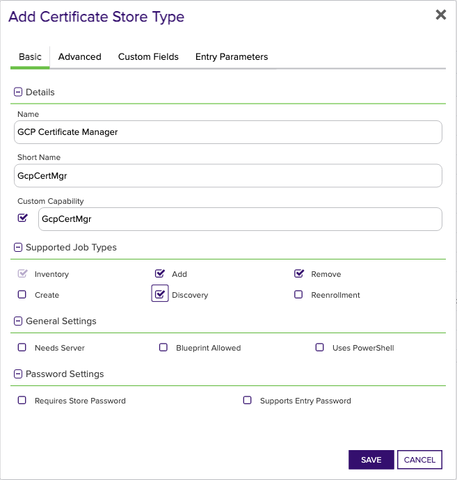
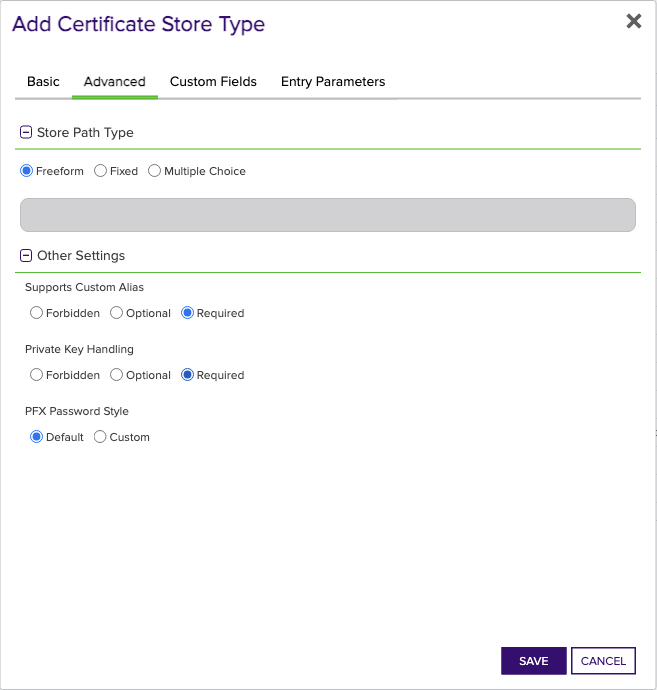
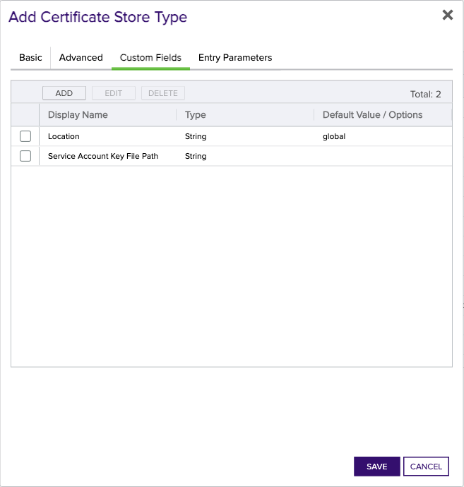

## GCP Certificate Manager

The GCP Certificate Manager Certificate Store Type in Keyfactor Command enables the seamless management of SSL/TLS certificates on the Google Cloud Platform Certificate Manager product. This Certificate Store Type represents a logical grouping of certificates managed within the GCP environment. It allows for various management operations on these certificates, including Inventory, Management Add, and Management Remove jobs.

One of the critical capabilities of this Certificate Store Type is the support for adding certificates with private keys, facilitating more secure communications and authentication within the cloud platform. However, there are significant caveats to be aware of — the GCP Certificate Manager Certificate Store Type supports the replacement of both unbound certificates and certificates bound to existing map entries, but it does not support specifying map entry bindings when adding new certificates.

This Certificate Store Type leverages a Google Service Account for authentication, requiring specific permissions and API access. Depending on the setup, either a service account JSON credential file or a VM residing within Google Cloud is needed for proper authentication. Be sure to configure the required custom fields and settings as specified, to avoid potential issues and confusion during deployment.

By adhering to these guidelines and understanding the limitations and capabilities, users can effectively manage their certificates within the GCP Certificate Manager environment using Keyfactor Command.


### Supported Job Types

| Job Name | Supported |
| -------- | --------- |
| Inventory | ✅ |
| Management Add | ✅ |
| Management Remove | ✅ |
| Discovery | ✅ |
| Create | ✅ |
| Reenrollment |  |

## Requirements

No requirements found


## Certificate Store Type Configuration

The recommended method for creating the `GcpCertMgr` Certificate Store Type is to use [kfutil](https://github.com/Keyfactor/kfutil). After installing, use the following command to create the `` Certificate Store Type:

```shell
kfutil store-types create GcpCertMgr
```

<details><summary>GcpCertMgr</summary>

Create a store type called `GcpCertMgr` with the attributes in the tables below:

### Basic Tab
| Attribute | Value | Description |
| --------- | ----- | ----- |
| Name | GCP Certificate Manager | Display name for the store type (may be customized) |
| Short Name | GcpCertMgr | Short display name for the store type |
| Capability | GcpCertMgr | Store type name orchestrator will register with. Check the box to allow entry of value |
| Supported Job Types (check the box for each) | Add, Discovery, Remove | Job types the extension supports |
| Supports Add | ✅ | Check the box. Indicates that the Store Type supports Management Add |
| Supports Remove | ✅ | Check the box. Indicates that the Store Type supports Management Remove |
| Supports Discovery | ✅ | Check the box. Indicates that the Store Type supports Discovery |
| Supports Reenrollment |  |  Indicates that the Store Type supports Reenrollment |
| Supports Create | ✅ | Check the box. Indicates that the Store Type supports store creation |
| Needs Server |  | Determines if a target server name is required when creating store |
| Blueprint Allowed |  | Determines if store type may be included in an Orchestrator blueprint |
| Uses PowerShell |  | Determines if underlying implementation is PowerShell |
| Requires Store Password |  | Determines if a store password is required when configuring an individual store. |
| Supports Entry Password |  | Determines if an individual entry within a store can have a password. |

The Basic tab should look like this:



### Advanced Tab
| Attribute | Value | Description |
| --------- | ----- | ----- |
| Supports Custom Alias | Required | Determines if an individual entry within a store can have a custom Alias. |
| Private Key Handling | Required | This determines if Keyfactor can send the private key associated with a certificate to the store. Required because IIS certificates without private keys would be invalid. |
| PFX Password Style | Default | 'Default' - PFX password is randomly generated, 'Custom' - PFX password may be specified when the enrollment job is created (Requires the Allow Custom Password application setting to be enabled.) |

The Advanced tab should look like this:



### Custom Fields Tab
Custom fields operate at the certificate store level and are used to control how the orchestrator connects to the remote target server containing the certificate store to be managed. The following custom fields should be added to the store type:

| Name | Display Name | Type | Default Value/Options | Required | Description |
| ---- | ------------ | ---- | --------------------- | -------- | ----------- |


The Custom Fields tab should look like this:




</details>

## Certificate Store Configuration

After creating the `GcpCertMgr` Certificate Store Type and installing the Google Cloud Provider Certificate Manager Universal Orchestrator extension, you can create new [Certificate Stores](https://software.keyfactor.com/Core-OnPrem/Current/Content/ReferenceGuide/Certificate%20Stores.htm?Highlight=certificate%20store) to manage certificates in the remote platform.

The following table describes the required and optional fields for the `GcpCertMgr` certificate store type.

| Attribute | Description | Attribute is PAM Eligible |
| --------- | ----------- | ------------------------- |
| Category | Select "GCP Certificate Manager" or the customized certificate store name from the previous step. | |
| Container | Optional container to associate certificate store with. | |
| Client Machine | The Google Cloud Platform (GCP) Project ID associated with the user's account. Example: 'my-gcp-project-id'. | |
| Store Path | The value 'n/a' should be used as the Store Path is not applicable for the GCP Certificate Manager Certificate Store type. | |
| Orchestrator | Select an approved orchestrator capable of managing `GcpCertMgr` certificates. Specifically, one with the `GcpCertMgr` capability. | |

* **Using kfutil**

    ```shell
    # Generate a CSV template for the AzureApp certificate store
    kfutil stores import generate-template --store-type-name GcpCertMgr --outpath GcpCertMgr.csv

    # Open the CSV file and fill in the required fields for each certificate store.

    # Import the CSV file to create the certificate stores
    kfutil stores import csv --store-type-name GcpCertMgr --file GcpCertMgr.csv
    ```

* **Manually with the Command UI**: In Keyfactor Command, navigate to Certificate Stores from the Locations Menu. Click the Add button to create a new Certificate Store using the attributes in the table above.