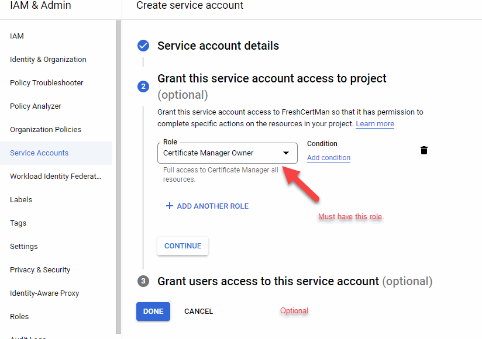
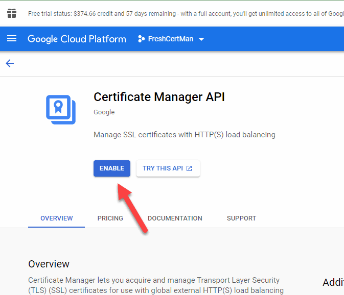
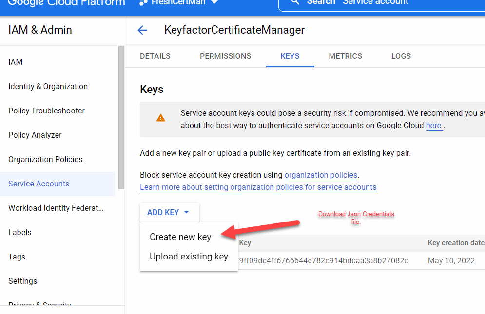

## Overview

The GCP Certificate Manager Orchestrator Extension remotely manages certificates on the Google Cloud Platform Certificate Manager Product.

This orchestrator extension implements three job types – Inventory, Management Add, and Management Remove. Below are the steps necessary to configure this Orchestrator Extension.  It supports adding certificates with private keys only.  The GCP Certificate Manager Orchestrator Extension supports the replacement of unbound certificates as well as certificates bound to existing map entries, but it does **not** support specifying map entry bindings when adding new certificates.

## Requirements

**Google Cloud Configuration**

1. Read up on [Google Certificate Manager](https://cloud.google.com/certificate-manager/docs) and how it works.

2. Either a Google Service Account is needed with the following permissions (Note: Workload Identity Management Should be used but at the time of the writing it was not available in the .net library yet), or the virtual machine running the Keyfactor Orchestrator Service must reside within Google Cloud.

3. The following Api Access is needed:

4. If authenticating via service account, download the Json Credential file as shown below:
