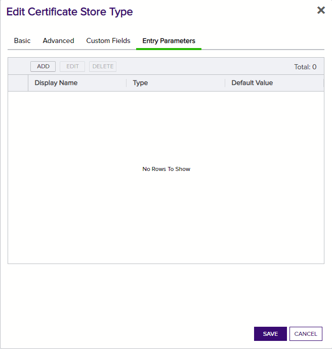

**Overview**

The GCP Certificate Manager Orchestrator remotely manages certificates on the Google Cloud Provider Certificate Manager Product.

This agent implements three job types – Inventory, Management Add, and Management Remove. Below are the steps necessary to configure this AnyAgent.  It supports adding certificates with or without private keys.

**1. Create the New Certificate Store Type for the GCP Certificate Manager Orchestrator**

In Keyfactor Command create a new Certificate Store Type similar to the one below:

#### STORE TYPE CONFIGURATION
SETTING TAB  |  CONFIG ELEMENT	| DESCRIPTION
------|-----------|------------------
Basic |Name	|Descriptive name for the Store Type.  Google Cloud Certificate Manager can be used.
Basic |Short Name	|The short name that identifies the registered functionality of the orchestrator. Must be GcpCertMgr
Basic |Custom Capability|Checked with Name GcpCertManager
Basic |Job Types	|Inventory, Add, and Remove are the supported job types. 
Basic |Needs Server	|Must be checked
Basic |Blueprint Allowed	|Unchecked
Basic |Requires Store Password	|Determines if a store password is required when configuring an individual store.  This must be unchecked.
Basic |Supports Entry Password	|Determined if an individual entry within a store can have a password.  This must be unchecked.
Advanced |Store Path Type| Determines how the user will enter the store path when setting up the cert store.  Freeform
Advanced |Supports Custom Alias	|Determines if an individual entry within a store can have a custom Alias.  This must be Required
Advanced |Private Key Handling |Determines how the orchestrator deals with private keys.  Required
Advanced |PFX Password Style |Determines password style for the PFX Password. Default
Custom Fields|Google Cloud Provider Project Location|Name:Location Display Name:Location Type:String Default Value:global Required:True
Custom Fields|Google Cloud Provider Project Number|Name:Project Number Display Name:Project Number Type:String Default Value:N/A Required:True
Entry Parameters|N/A| There are no Entry Parameters

**Basic Settings:**

**Advanced Settings:**

**Custom Fields:**

**Entry Params:**

**2. Register the GCP Certificate Manager Orchestrator with Keyfactor**
See Keyfactor InstallingKeyfactorOrchestrators.pdf Documentation.  Get from your Keyfactor contact/representative.

**3. Create a GCP Certificate Manager Certificate Store within Keyfactor Command**
In Keyfactor Command create a new Certificate Store similar to the one below

#### STORE CONFIGURATION 
CONFIG ELEMENT	|DESCRIPTION
----------------|---------------
Category	|The type of certificate store to be configured. Select category based on the display name configured above "GCP Certificate Manager".
Container	|This is a logical grouping of like stores. This configuration is optional and does not impact the functionality of the store.
Client Machine	|The name of the Google Certificate Manager Credentials File.  This file should be stored in the same directory as the Orchestrator binary.  Sample is "favorable-tree-346417-feb22d67de35.json".
Store Path	|This will be the name of the Google Cloud Project.  Sample here is "favorable-tree-346417".
Orchestrator	|This is the orchestrator server registered with the appropriate capabilities to manage this certificate store type. 
Inventory Schedule	|The interval that the system will use to report on what certificates are currently in the store. 
Use SSL	|This should be checked.
User	|This is not necessary.
Password |This is not necessary.

*** 

#### Usage

**Adding New Certificate No Map Entry**

*** 

**Adding New Certificate With Map Entry**

*** 

**Replace Certficate With Map Entry**

*** 

**Replace Certficate No Map Entry**

*** 

**Remove Certificate With Map Entry**

*** 

**Replace Certficate With Map Entry**

*** 

**Replace Certficate No Map Entry**

**Remove Certificate No Map Entry**

*** 

**Replace Certficate With Map Entry**

*** 

**Replace Certficate No Map Entry**

